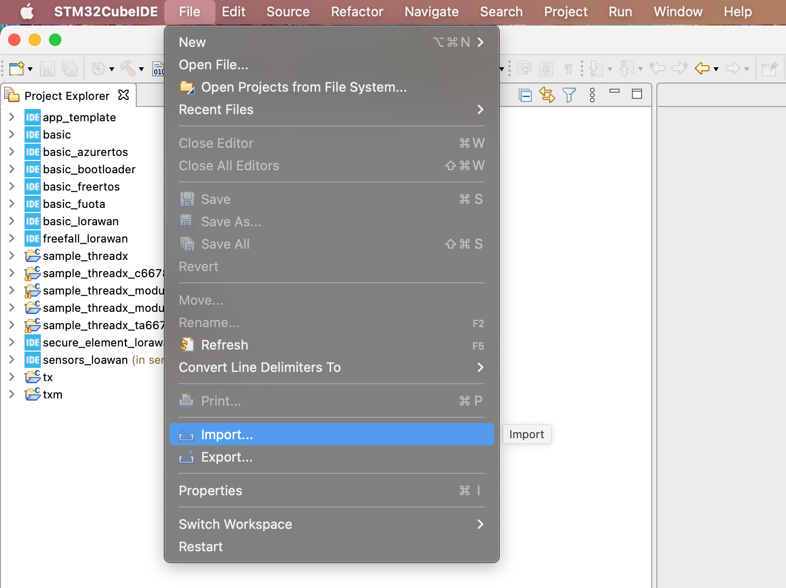
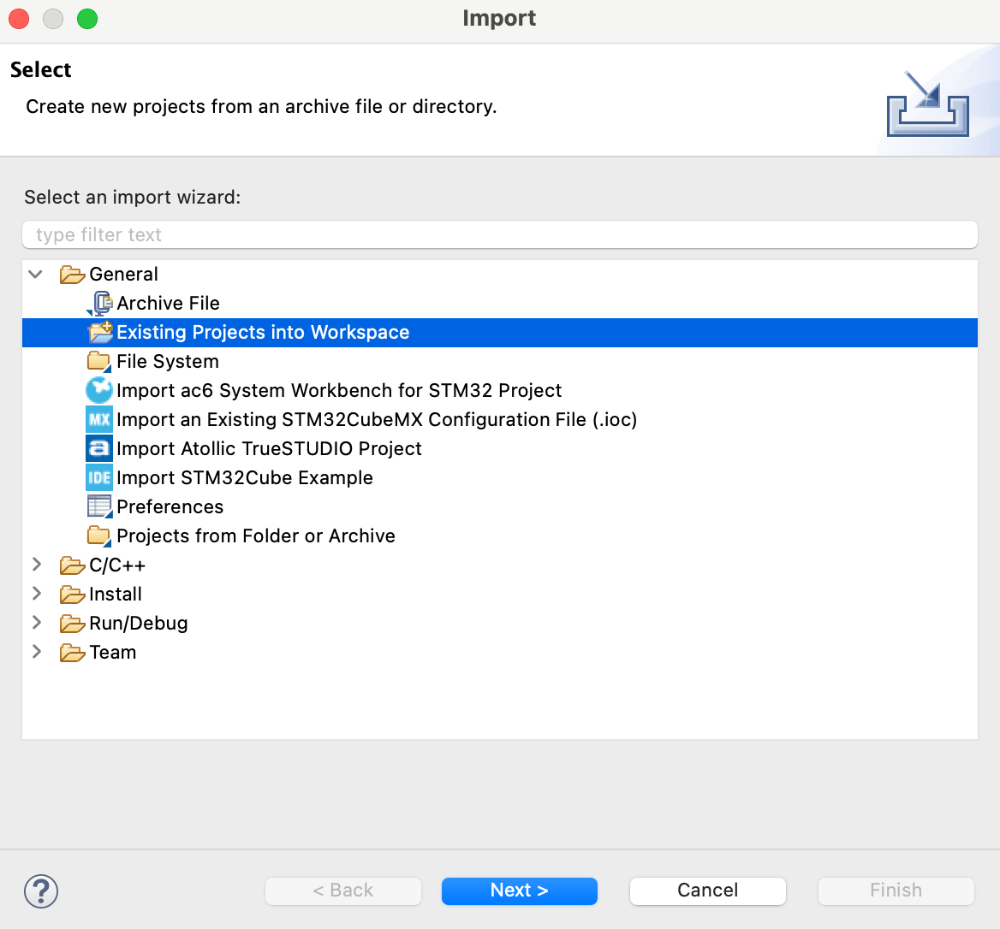
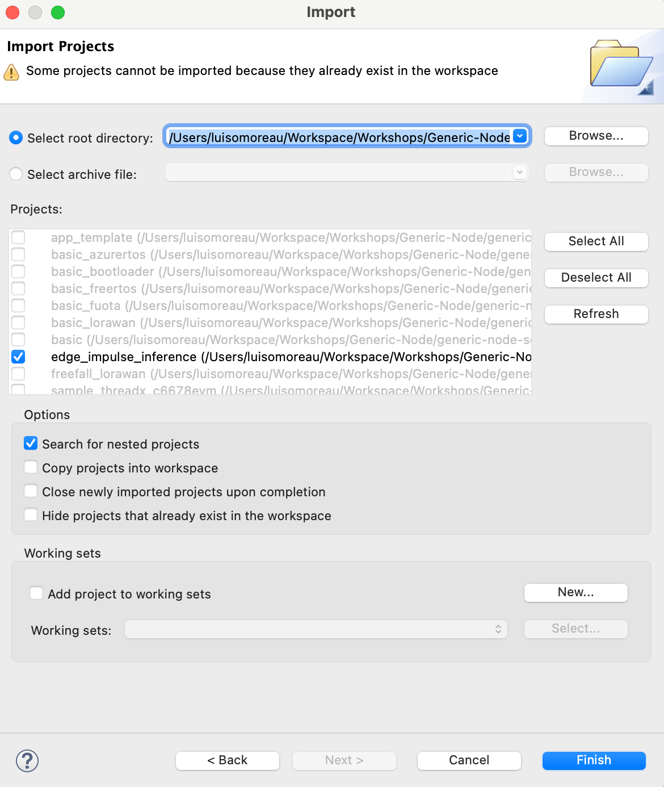
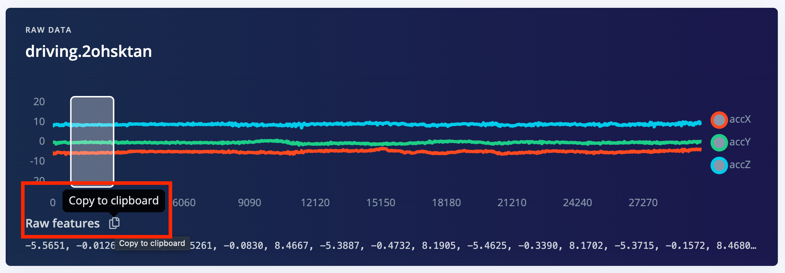

# Edge Impulse Inferencing on the Generic Node (TheThingsIndustry)

## Overview

This repository contains the minimal example code for running an Edge Impulse designed models on the [Generic Node](https://www.genericnode.com/docs/)

## Prerequisites

**Edge Impulse:**

Make sure you followed the [Continuous motion recognition](https://docs.edgeimpulse.com/docs/continuous-motion-recognition) tutorial, and have a trained impulse.

**Generic Node:**

Install the following software [STM32CubeIDE](https://www.st.com/en/development-tools/stm32cubeide.html) and import the [Generic Node Sensor Edition](https://www.genericnode.com/docs/getting-started/se-sw/) default projects with STM32CubeIDE.


## Cloning the base repository

We created an example repository that contains the STM32CubeIDE project. Clone or download this repository at [example-inferencing-generic-node](https://github.com/edgeimpulse/example-inferencing-generic-node).

## Deploying your impulse

Head over to your Edge Impulse project, and go to **Deployment**. From here you can create the full library which contains the impulse and all external required libraries. Select **C++ library**, and click **Build** to create the library.

Download the `.zip` file, extract it and copy the two following folders, `model-parameters` and `tflite-model` to `example-inferencing-generic-node/Core`.

**Downloaded Edge Impulse C++ Library:**

```
├── CMakeLists.txt
├── edge-impulse-sdk
├── model-parameters      <- Copy
└── tflite-model          <- Copy
```

**example-inferencing-generic-node repository:**

```
├── CMakeLists.txt
├── Core
│   ├── edge-impulse-sdk
│   ├── model-parameters    <- Paste
│   └── tflite-model        <- Paste
├── LICENSE
├── README.md
├── app.h
├── conf
├── main.cpp
├── stm32wlxx_it.c
└── stm32wlxx_it.h
```

Now copy the full `example-inferencing-generic-node` folder to `generic-node-se/Software/app/` which contains the project examples from the Generic Node that you should have imported from the [Prerequisites](#Prerequisites).

Open STM32CubeIDE and import your new project:

* Click on **File -> Import**:



* Select **Existing Projects into Workspace**:



* Select your new project called `edge_impulse_inference`:



* Open the `main.cpp` file and replace the following `features[]` buffer with the ones provided in your Edge Impulse project **Live Classification** view on the Studio:

```
float features[] = {
		// copy and replace raw features here (for example from the 'Live classification' page)
		};
```



Build your project and flash it as you would do normally.

See the Generic Node Documentation for more info: [https://www.genericnode.com/docs/getting-started/se-sw/env-setup/stm32cubeide/](https://www.genericnode.com/docs/getting-started/se-sw/env-setup/stm32cubeide/)

Now open a Serial Monitor and you should see the following output with your custom parameters:

```
Inferencing settings:
	Interval: 20 ms.
	Frame size: 300
	Sample length: 6 ms.
	No. of classes: 3

Edge Impulse standalone inferencing
Getting signal...Done
Run classifier...Done
run_classifier returned: 0
Predictions (DSP: 61 ms., Classification: 2 ms., Anomaly: 0 ms.): 
    driving: 	 100%
    idle: 	 0%
    unknown: 	 0%

```

That's it! If you have any questions, please go to [https://forum.edgeimpulse.com](https://forum.edgeimpulse.com)


